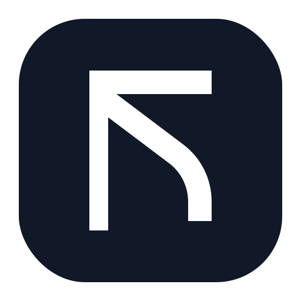

<p align="center">
  
</p>

<h1 align="center">Stone</h1>

<p align="center">
  <strong>A local-first desktop workspace for notes, journals, meetings, and project memory.</strong>
</p>

<p align="center">
  <a href="#who-it-is-for">Who it is for</a> |
  <a href="#what-it-does">What it does</a> |
  <a href="#privacy-model">Privacy</a> |
  <a href="#install">Install</a> |
  <a href="#development">Development</a>
</p>

<p align="center">
  
  
  
</p>

---

Stone is for people who want their working memory in files they own.

It is a desktop app for Markdown notes, daily journals, task capture, meeting records, and semantic search. Your workspace is a normal folder on disk. Stone adds a fast editor, local indexes, Git-friendly history, and optional AI-assisted workflows around it without turning your notes into a hosted service.

## Who It Is For

Stone is built for:

- Developers and technical leads who want project notes, meeting context, and decisions in plain text.
- Researchers, founders, and operators who keep a daily work journal and need to recover context quickly.
- People who like tools such as Obsidian, Logseq, and Notion, but want a native local workspace with stronger file ownership.

Stone is probably not the right fit if you need multiplayer editing, mobile apps, or a hosted team wiki today.

## What It Does

### Today-first workflow

Stone opens on Today: the place for your current journal, meetings, tasks, recent edits, and "on this day" context. It is meant to answer the practical question: what am I working from right now?

### Markdown notes that stay portable

- Notes live as Markdown files in your workspace.
- SQLite stores metadata and indexes, not the canonical body of your notes.
- Workspaces are ordinary folders that can be backed up, searched, synced, or versioned with tools you already use.

### Fast writing surface

- Rich TipTap editor with headings, lists, quotes, code blocks, links, tables, and images.
- Slash commands for quick structure.
- Raw Markdown is still the durable storage format.
- Mermaid diagrams render directly in notes.

### Journals and tasks

- Daily journals are first-class, not an afterthought.
- Task states support practical flows such as `TODO`, `DOING`, `DONE`, `WAITING`, `HOLD`, `CANCELED`, and `IDEA`.
- Journal entries, regular notes, and meeting records can all feed the same workspace memory.

### Meetings and voice notes

- Record meetings or voice notes from Stone.
- Transcription runs locally.
- Audio is treated as temporary capture material and deleted after transcription.
- Meeting summaries can be reviewed and sent into the journal when you are ready.

### Search, graph, and related notes

- Full-text search for exact recall.
- Semantic search and related-note scoring for rediscovering nearby work.
- Link and tag structure contributes to ranking, so Stone can surface useful context without relying only on embeddings.

### Git-backed ownership

- Initialize Git for a workspace from inside Stone.
- Commit, pull, push, and sync notes without leaving the app.
- The workspace remains a normal repository, so you are not locked into Stone's UI.

### Optional AI

Stone can use local and provider-backed AI adapters for features such as Ask Notes, summaries, embeddings, and transcription. The architecture keeps providers behind outbound adapters, so the app owns retrieval, ranking, indexing, and persistence.

## Privacy Model

Stone is local-first by default:

- Your notes are files on your machine.
- The app does not require a Stone account.
- There is no Stone cloud backend.
- Meeting transcription is local.
- External AI providers are optional and only apply to features you configure.
- External links open in the system browser, not inside a privileged Electron window.

Security posture:

- Renderer windows run with `nodeIntegration: false` and `contextIsolation: true`.
- IPC channels are validated at the app boundary.
- Foreign navigation and `window.open` are denied for app windows.
- The production dependency tree currently audits clean with `pnpm audit --prod`.

## Install

Download the latest macOS build from GitHub:

[github.com/peritissimus/stone-electron/releases/latest](https://github.com/peritissimus/stone-electron/releases/latest)

Current release artifacts are macOS DMG and ZIP builds. Windows and Linux packaging targets exist in the project configuration, but release automation currently publishes macOS builds.

## Development

### Prerequisites

- Node.js 20+
- pnpm 10.27.0 via Corepack
- macOS with Xcode Command Line Tools for the native audio helper

### Run Locally

```bash
git clone git@github.com:peritissimus/stone-electron.git stone
cd stone

corepack enable
pnpm install
pnpm dev
```

### Common Commands

```bash
pnpm dev              # Start Vite and Electron in development
pnpm build            # Build native helper, main, worker, preload, and renderer
pnpm package          # Package for the current platform
pnpm typecheck        # TypeScript type checking
pnpm lint             # ESLint
pnpm test             # Unit and integration tests
pnpm test:e2e         # Build and run Playwright end-to-end tests
pnpm audit --prod     # Check shipped dependencies for known vulnerabilities
```

## Architecture

Stone is an Electron app with a hexagonal main process and a layered React renderer.

```text
src/
  main/
    domain/            pure entities, value objects, services, ports
    application/       use cases and DTOs
    adapters/          IPC, persistence, storage, integrations
    infrastructure/    DI, database setup, Electron bootstrap, workers
  renderer/
    api/               thin IPC wrappers
    stores/            Zustand state
    hooks/             React lifecycle and state composition
    components/        UI components
    pages/             route-level screens
  shared/              serializable cross-process types and channel constants
```

Core rule: dependencies point inward. Domain code has no external imports, use cases depend on ports, adapters implement ports, and infrastructure wires concrete implementations together.

## Tech Stack

| Area | Technology |
| --- | --- |
| Desktop | Electron |
| UI | React, TypeScript, Vite |
| Editor | TipTap / ProseMirror |
| Styling | Tailwind CSS, Radix primitives |
| State | Zustand |
| Storage | Markdown files, SQLite/libSQL, Drizzle ORM |
| Search | Full-text, local embeddings, workspace ranking |
| Diagrams | Mermaid |
| Testing | Vitest, Playwright |
| Packaging | electron-builder |

## Status

Stone is actively developed and currently best tested on macOS. The file format is intentionally boring: Markdown files in folders, with local metadata and indexes that can be rebuilt.

## Contributing

Issues and pull requests are welcome. Before opening a larger change, read [CONTRIBUTING.md](CONTRIBUTING.md) and keep changes aligned with the architecture rules in [AGENTS.md](AGENTS.md).
