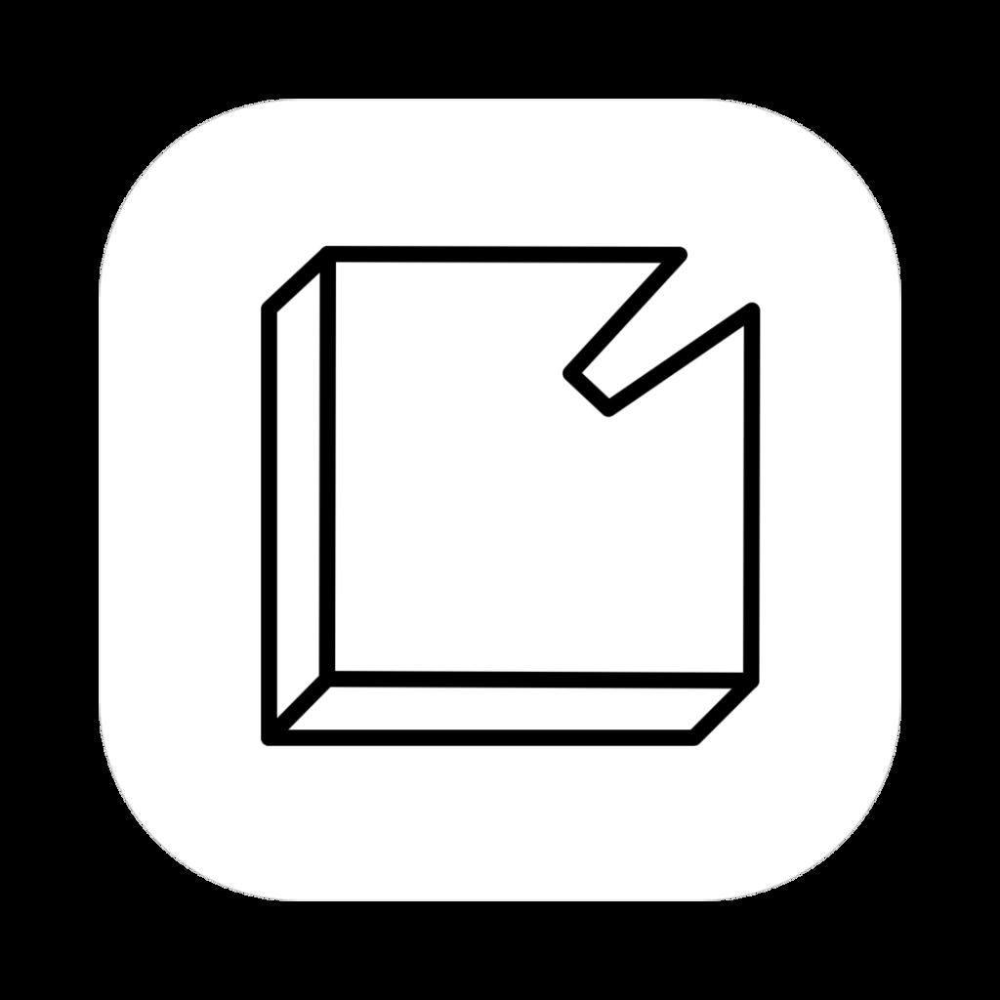

<p align="center">
  
</p>

<h1 align="center">Stone</h1>

<p align="center">
  <strong>A local-first desktop workspace for notes, journals, meetings, and project memory.</strong>
</p>

<p align="center">
  <a href="#who-it-is-for">Who it is for</a> |
  <a href="#what-it-does">What it does</a> |
  <a href="#privacy-and-security">Privacy</a> |
  <a href="#install">Install</a> |
  <a href="#development">Development</a>
</p>

<p align="center">
  
  
  
</p>

---

<!-- TODO: add a product screenshot or short GIF here — it is the single
     highest-leverage thing this README is missing. Drop it under docs/ and
     reference it: <p align="center"></p> -->

**Stone keeps your working memory in plain files you own.** It is a desktop app for Markdown notes, daily journals, tasks, meeting records, and semantic search — your workspace is just a folder on disk. Stone wraps it in a fast editor, local search indexes, Git-friendly history, and optional AI, without turning your notes into a hosted service.

## Who It Is For

Stone is built for:

- Developers and technical leads who want project notes, meeting context, and decisions in plain text.
- Researchers, founders, and operators who keep a daily work journal and need to recover context quickly.
- People who like tools such as Obsidian, Logseq, and Notion, but want a native local workspace with stronger file ownership.

It is not the right fit if you need multiplayer editing, mobile apps, or a hosted team wiki.

## What It Does

Three things set Stone apart:

- **Your notes are just files.** Plain Markdown in a folder you own. SQLite holds only metadata and indexes, which can be rebuilt from the files at any time.
- **Capture stays local.** Meetings and voice notes transcribe on-device — on macOS, system audio is mixed with your mic so you catch everyone in the room. Audio is deleted after transcription.
- **Retrieval you control.** Full-text and semantic search, topic clustering, a link graph, and related-note scoring all run on your machine. AI is optional and sits behind it, never in front of your data.

Stone is organized around six places — **Today**, **Journals**, **Tasks**, **Knowledge**, **Graph**, and **Meetings** — and a command palette (`Cmd+K`) that jumps to any of them, any note, or any action.

### Today

Your landing page: current journal, meetings, tasks, recent edits, and "on this day" context in one view. It answers a single question — what am I working from right now? — and can spin your recent activity into a shareable status report.

### Notes and editing

- Rich TipTap editor: headings, lists, quotes, code blocks, links, tables, images, and Mermaid diagrams that render inline.
- Slash commands for structure; templates for note shapes you reuse.
- Raw Markdown remains the durable storage format.

### Journals and tasks

- Daily journals are a primary surface, not a plugin.
- Tasks are pulled from across your notes into one view, with states for real workflows: `TODO`, `DOING`, `DONE`, `WAITING`, `HOLD`, `CANCELED`, `IDEA`.
- Journals, notes, and meeting records all feed the same workspace memory.

### Meetings and voice notes

- Record a meeting or grab a quick thought from a floating capture window.
- Local transcription, with macOS system-audio mixing so remote participants are captured too.
- Review the summary, then send it into your journal.

### Find and connect

- Full-text search for exact recall; semantic search for rediscovering nearby work.
- **Knowledge** clusters your workspace into topics, so you can see what you actually write about.
- **Graph** shows how notes link together.
- Related-note scoring blends embeddings, lexical overlap, shared tags, and link structure — calibrated to your own workspace, so it works without relying on embeddings alone.
- Smart link suggestions surface notes worth connecting as you write.

### Git and AI

- Initialize, commit, pull, push, and sync from inside Stone, with honest conflict and error reporting. The workspace stays a normal repository — no lock-in.
- **Ask Notes** answers questions grounded in your workspace and cites the source notes. Summaries, status reports, embeddings, and transcription use local or provider-backed models you configure.

## Privacy and Security

Stone is local-first by default — no account, no Stone cloud backend, no telemetry. Your notes never leave your machine unless you put them somewhere yourself (Git, a backup, a synced folder). External AI providers are opt-in and apply only to the features you configure.

The app is hardened against the usual Electron risks:

- Renderer windows run with `nodeIntegration: false` and `contextIsolation: true`.
- IPC channels are validated at the app boundary.
- Foreign navigation and `window.open` are denied; external links open in your system browser.
- The production dependency tree audits clean with `pnpm audit --prod`.

## Install

Download the latest macOS build from GitHub:

[github.com/peritissimus/stone-electron/releases/latest](https://github.com/peritissimus/stone-electron/releases/latest)

Current release artifacts are macOS DMG and ZIP builds. Windows and Linux packaging targets exist in the project configuration, but release automation currently publishes macOS builds.

### First launch on macOS

Stone isn't notarized by Apple yet, so macOS blocks it the first time. To get past it once:

1. Drag Stone into **Applications**.
2. Right-click (or Control-click) Stone → **Open** → **Open** again.
3. If macOS only offers "Move to Trash," go to **System Settings → Privacy & Security**, scroll down, and click **Open Anyway**.

Or clear the quarantine flag from a terminal and skip the prompts entirely:

```bash
xattr -dr com.apple.quarantine /Applications/Stone.app
```

## Development

### Prerequisites

- Node.js 20+
- pnpm 10.27.0 via Corepack
- macOS with Xcode Command Line Tools for the native audio helper

### Run Locally

```bash
git clone git@github.com:peritissimus/stone-electron.git stone
cd stone

corepack enable
pnpm install
pnpm dev
```

### Common Commands

```bash
pnpm dev              # Start Vite and Electron in development
pnpm build            # Build native helper, main, worker, preload, and renderer
pnpm package          # Package for the current platform
pnpm typecheck        # TypeScript type checking
pnpm lint             # ESLint
pnpm test             # Unit and integration tests
pnpm test:e2e         # Build and run Playwright end-to-end tests
pnpm audit --prod     # Check shipped dependencies for known vulnerabilities
```

## Architecture

Stone is an Electron app with a hexagonal main process and a layered React renderer.

```text
src/
  main/
    domain/            pure entities, value objects, services, ports
    application/       use cases and DTOs
    adapters/          IPC, persistence, storage, integrations
    infrastructure/    DI, database setup, Electron bootstrap, workers
  renderer/
    api/               thin IPC wrappers
    stores/            Zustand state
    hooks/             React lifecycle and state composition
    components/        UI components
    pages/             route-level screens
  shared/              serializable cross-process types and channel constants
```

Core rule: dependencies point inward. Domain code has no external imports, use cases depend on ports, adapters implement ports, and infrastructure wires concrete implementations together.

## Tech Stack

| Area | Technology |
| --- | --- |
| Desktop | Electron |
| UI | React, TypeScript, Vite |
| Editor | TipTap / ProseMirror |
| Styling | Tailwind CSS, Radix primitives |
| State | Zustand |
| Storage | Markdown files, SQLite/libSQL, Drizzle ORM |
| Search | Full-text, local embeddings, workspace ranking |
| Diagrams | Mermaid |
| Testing | Vitest, Playwright |
| Packaging | electron-builder |

## Status

Stone is actively developed and currently best tested on macOS. The file format is intentionally boring: Markdown files in folders, with local metadata and indexes that can be rebuilt.

## Contributing

Issues and pull requests are welcome. Before opening a larger change, read [CONTRIBUTING.md](CONTRIBUTING.md) and keep changes aligned with the architecture rules in [AGENTS.md](AGENTS.md).
