# Stone Note-Taking App - High-Level Design Document

## 1. Architecture Overview

Stone is a production-ready Electron-based note-taking application with a comprehensive database management system, migration framework, and advanced search capabilities.

### System Architecture Diagram

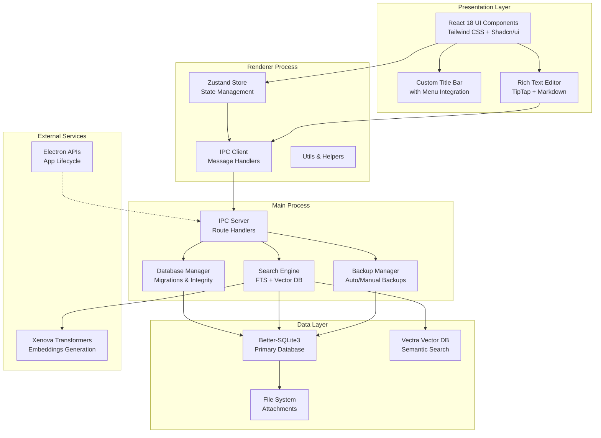

## 2. Database Architecture

### 2.1 Schema Diagram

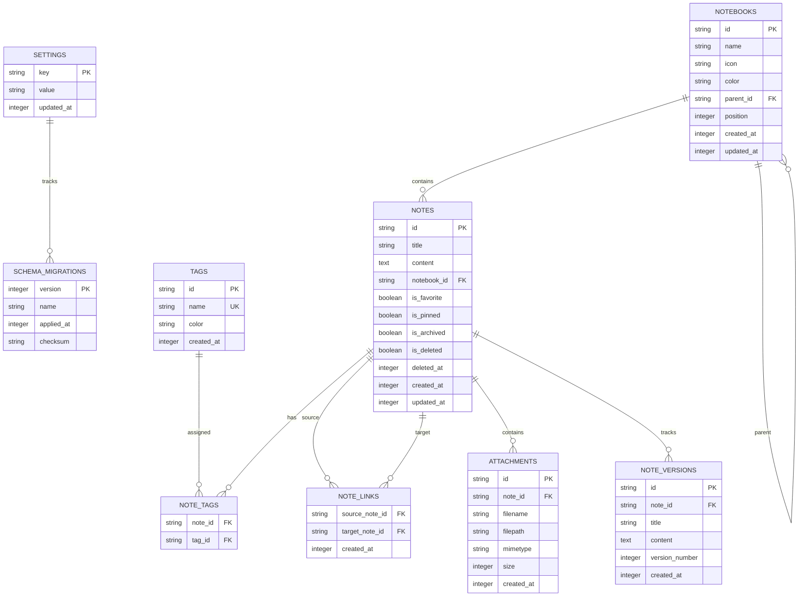

### 2.2 Database Flow Diagram

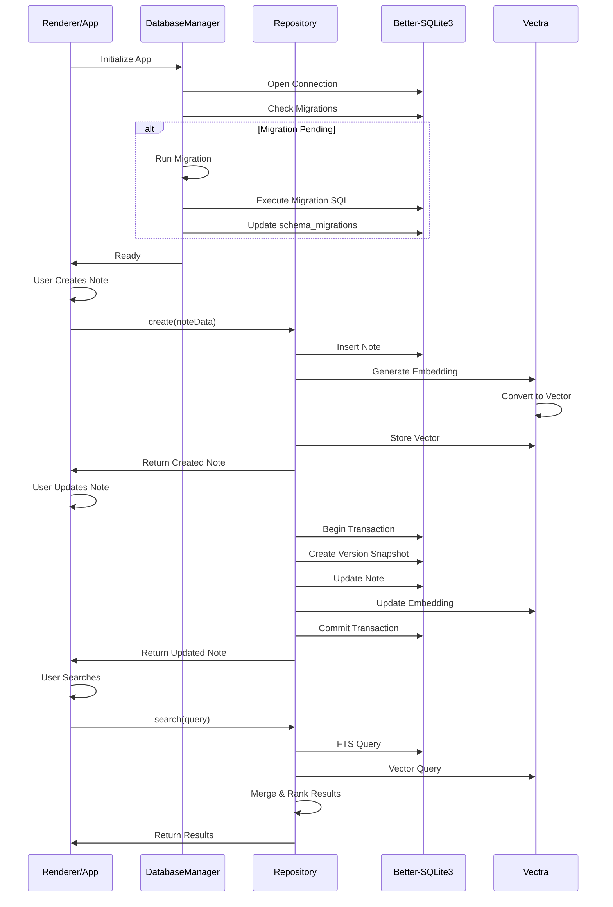

## 3. Migration System Architecture

### 3.1 Migration Lifecycle

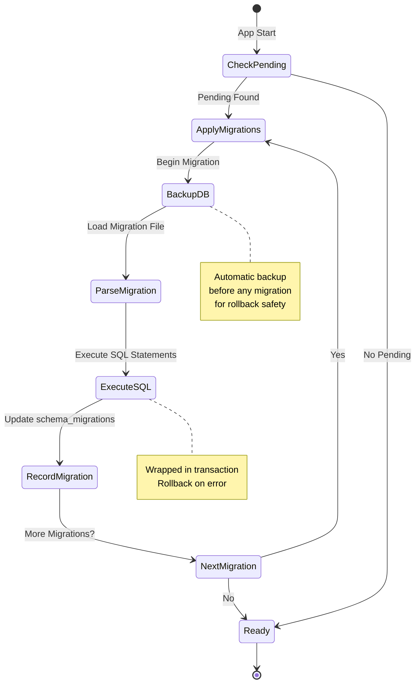

### 3.2 Migration Runner Flow

```mermaid
graph TD
    A["Migration Runner Started"] --> B{"Migration Pending?"}
    B -->|No| C["App Ready"]
    B -->|Yes| D["Create Backup"]
    D --> E["Load Migration File"]
    E --> F["Parse SQL Statements"]
    F --> G["Begin Transaction"]
    G --> H{"Execute Each<br/>Statement"}
    H -->|Error| I["Rollback Transaction"]
    I --> J["Restore from Backup"]
    J --> K["Report Error to UI"]
    H -->|Success| L["Next Statement"]
    L --> H
    H -->|All Complete| M["Commit Transaction"]
    M --> N["Record in schema_migrations"]
    N --> O{"More Migrations?"}
    O -->|Yes| E
    O -->|No| P["App Ready"]
    K --> Q["App Error State"]
    P --> C
    Q --> [*]
    C --> [*]
```

## 4. Repository Pattern Architecture

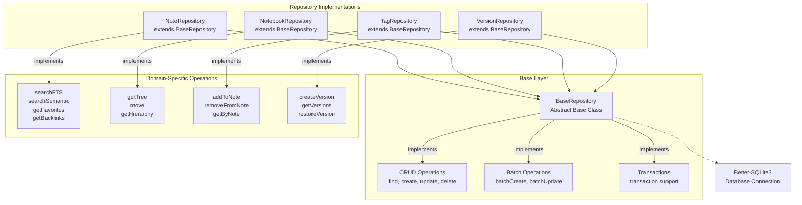

## 5. Search System Architecture

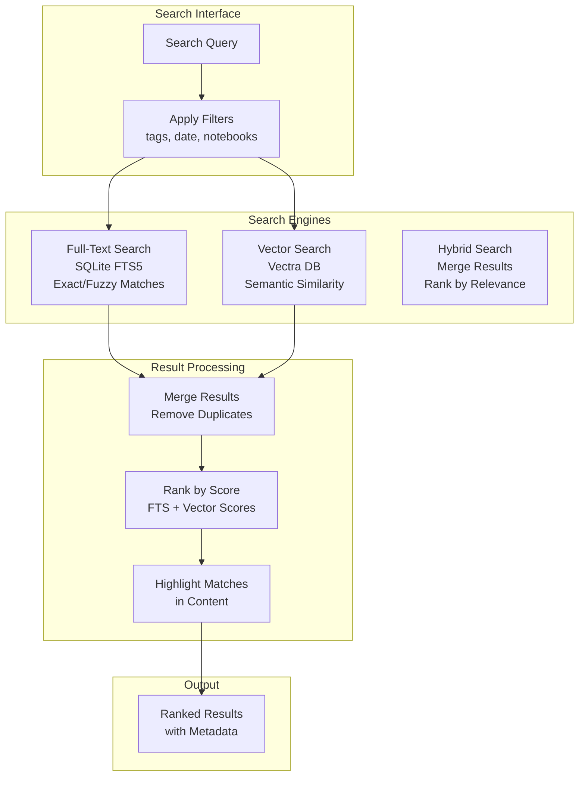

## 6. IPC Communication Architecture

### 6.1 IPC Channels Organization

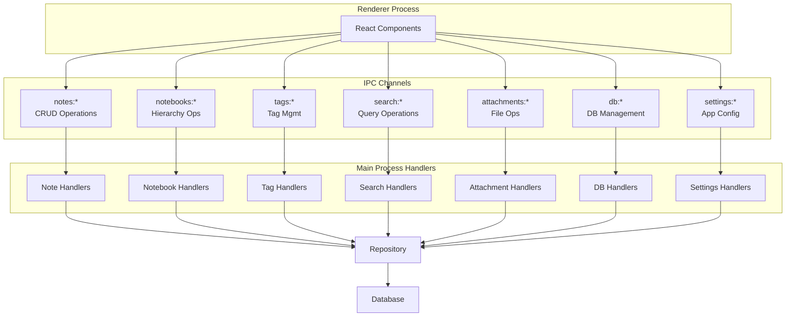

## 7. Data Flow - Create Note with Embedding

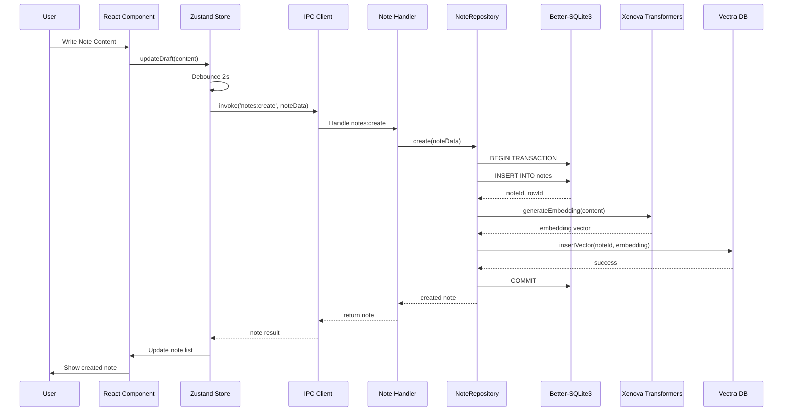

## 8. Backup and Restore Flow

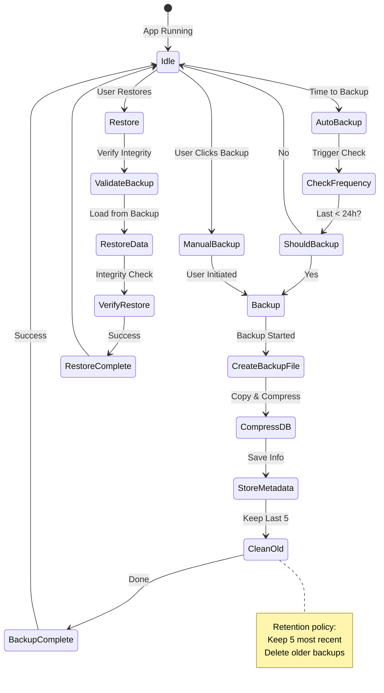

## 9. File Organization Structure

```mermaid
graph TD
    A["Stone Project Root"] --> B["src/"]
    A --> C["docs/"]
    A --> D["public/"]
    A --> E["migrations/"]
    A --> F["config/"]

    B --> B1["main/"]
    B --> B2["renderer/"]
    B --> B3["shared/"]

    B1 --> B1A["database/"]
    B1A --> B1A1["DatabaseManager.ts"]
    B1A --> B1A2["MigrationRunner.ts"]
    B1A --> B1A3["BackupManager.ts"]

    B1 --> B1B["repositories/"]
    B1B --> B1B1["BaseRepository.ts"]
    B1B --> B1B2["NoteRepository.ts"]
    B1B --> B1B3["NotebookRepository.ts"]
    B1B --> B1B4["TagRepository.ts"]
    B1B --> B1B5["VersionRepository.ts"]

    B1 --> B1C["ipc/"]
    B1C --> B1C1["handlers/"]
    B1C --> B1C2["channels.ts"]

    B1 --> B1D["services/"]
    B1D --> B1D1["SearchService.ts"]
    B1D --> B1D2["EmbeddingService.ts"]

    B1 --> B1E["preload.ts"]
    B1 --> B1F["index.ts"]

    B2 --> B2A["pages/"]
    B2 --> B2B["components/"]
    B2 --> B2C["stores/"]
    B2 --> B2D["hooks/"]
    B2 --> B2E["App.tsx"]
    B2 --> B2F["main.tsx"]

    B3 --> B3A["types/"]
    B3 --> B3B["constants/"]
    B3 --> B3C["utils/"]

    E --> E1["001_initial_schema.sql"]
    E --> E2["002_add_fts_index.sql"]
    E --> E3["migration_template.sql"]

    F --> F1["electron-builder.yml"]
    F --> F2["vite.config.ts"]
```

## 10. Component Hierarchy

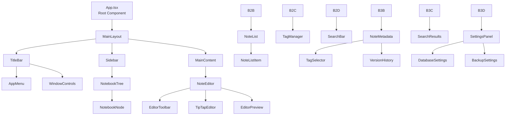

## 11. State Management Architecture

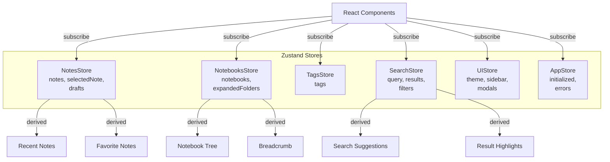

## 12. Error Handling and Recovery Flow

```mermaid
graph TD
    A["Error Occurs"] --> B{"Error Type?"}

    B -->|Migration| C["Migration Error Handler"]
    C --> D["Log to File"]
    D --> E["Restore from Backup"]
    E --> F["Report to User"]
    F --> G["App Error State"]

    B -->|Database| H["DB Error Handler"]
    H --> D
    H --> I{"Recoverable?"}
    I -->|Yes| J["Retry Operation"]
    J --> K["Resume Normal Op"]
    I -->|No| G

    B -->|IPC| L["IPC Error Handler"]
    L --> D
    L --> M["Return Error Response"]
    M --> N["UI Shows Error Toast"]
    N --> K

    B -->|Search| O["Search Error Handler"]
    O --> D
    O --> P["Fallback to FTS"]
    P --> K

    K --> Q["User Informed"]
    Q --> [*]
    G --> Q
```

## 13. Performance Optimization Strategy

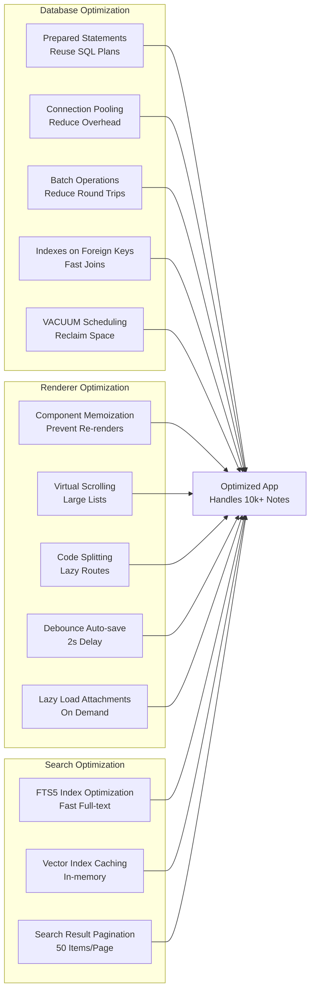

## 14. Security Considerations

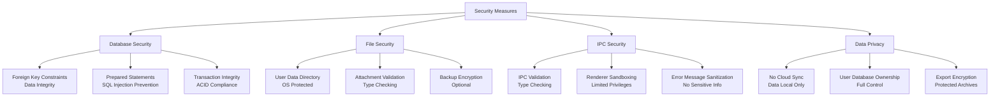

## 15. Development Workflow

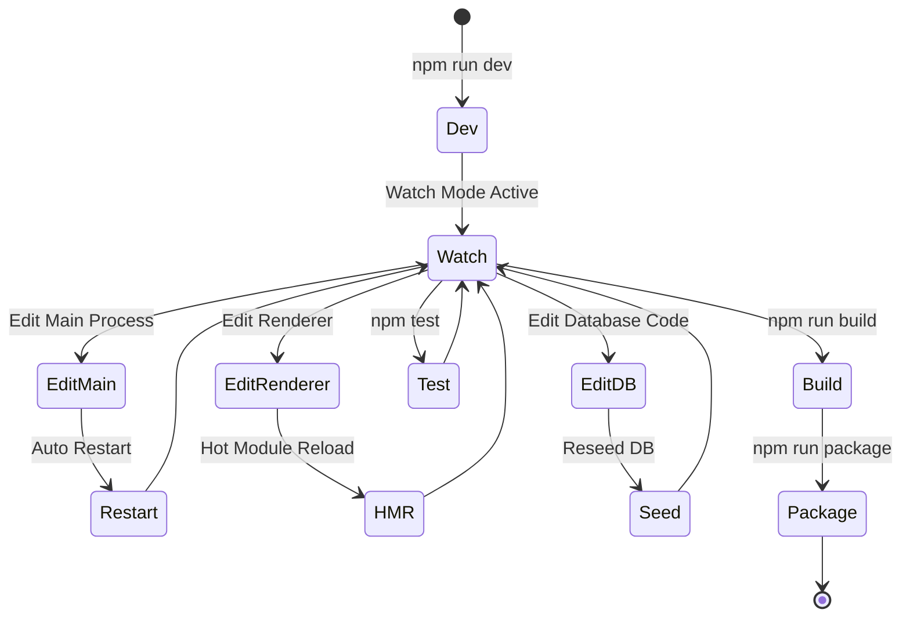

## 16. Migration Strategy Timeline

```
Phase 1: Foundation (Weeks 1-2)
├── Database manager with migration system
├── Repository pattern implementations
└── Basic CRUD operations

Phase 2: Editor & Storage (Weeks 3-4)
├── Rich text editor integration
├── Auto-save system
├── Version history

Phase 3: Search & Discovery (Weeks 5-6)
├── Full-text search implementation
├── Vector embeddings
├── Hybrid search

Phase 4: UI & UX (Weeks 7-8)
├── Main layout and components
├── Settings panel
├── Database management UI

Phase 5: Advanced Features (Weeks 9-10)
├── Export/import system
├── Backup/restore UI
├── Settings persistence

Phase 6: Polish & Testing (Weeks 11-12)
├── Error handling
├── Performance optimization
├── Packaging and distribution
```

---

**Document Version:** 1.0
**Last Updated:** 2025-10-29
**Status:** Architecture Design Complete - Ready for Implementation
